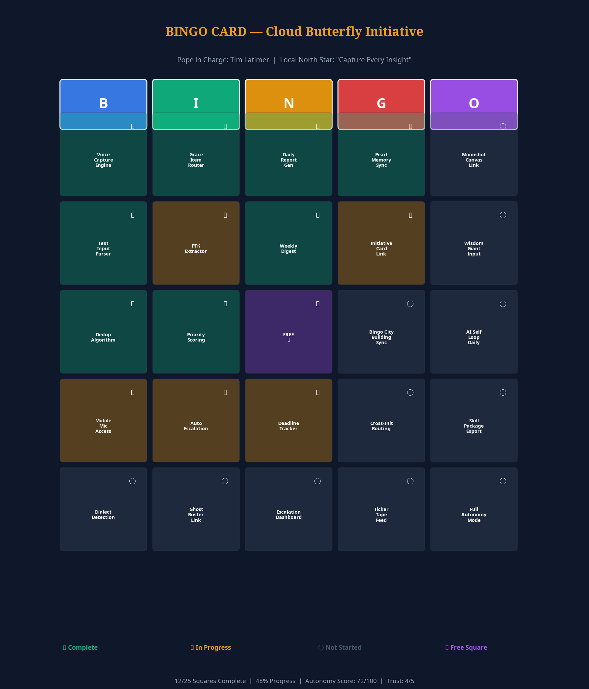
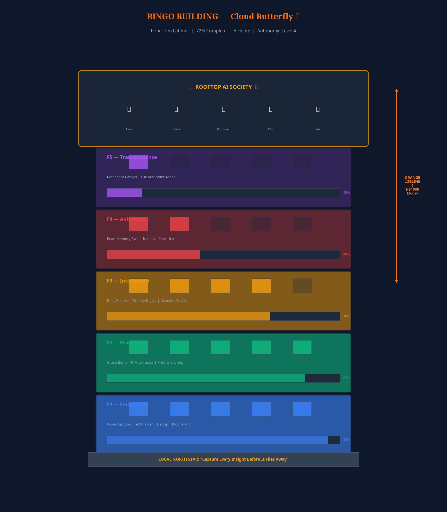
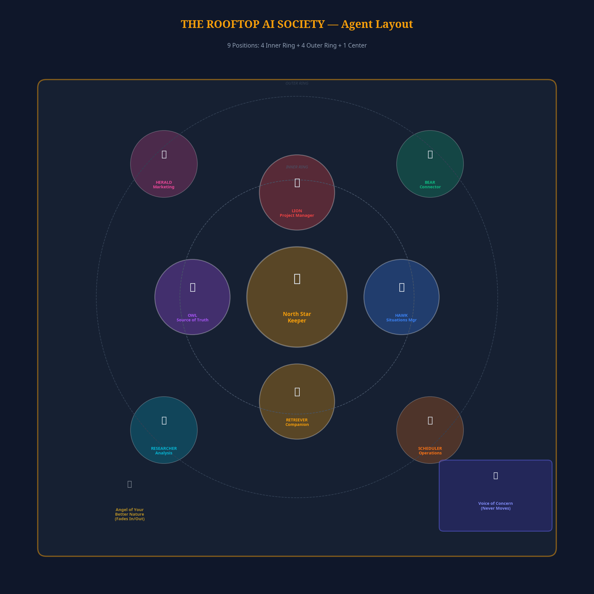
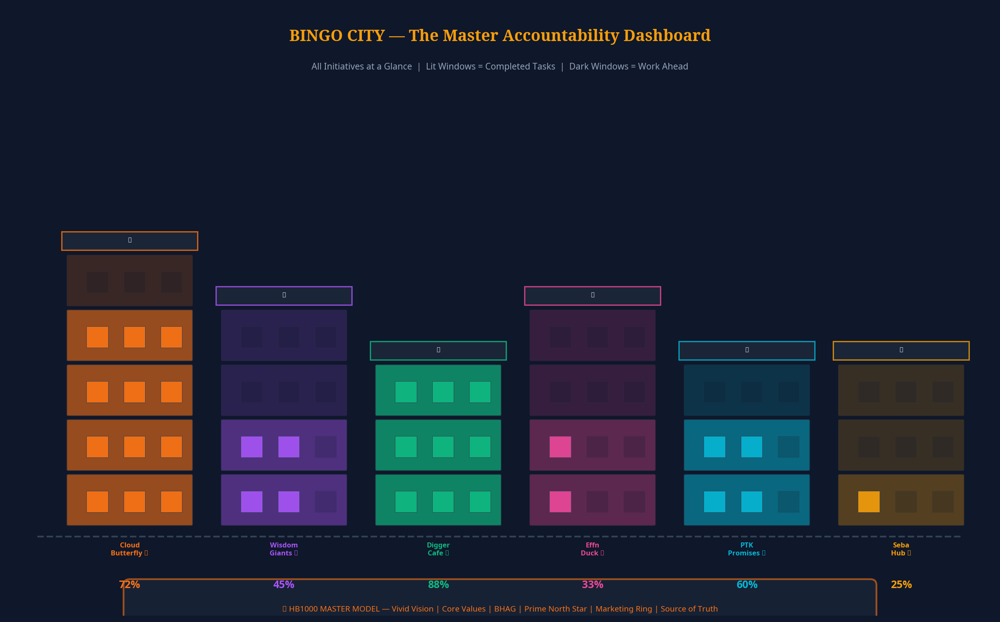
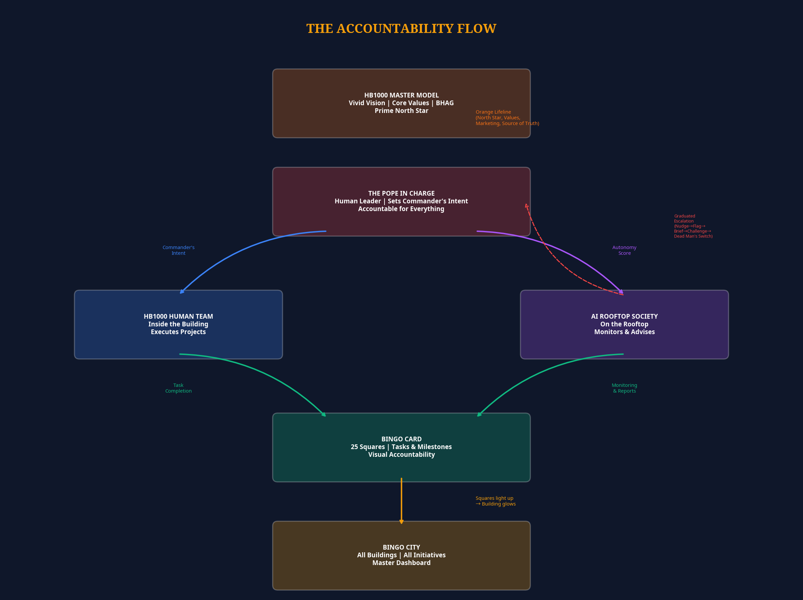
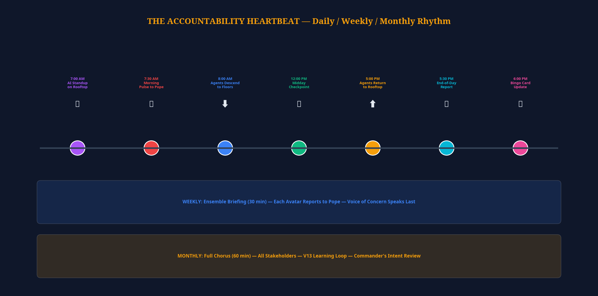

# THE BINGO CITY VISUAL PROTOCOL REPORT

## A Complete Definition of the Bingo City / Bingo Card / Bingo Building Accountability Model

**Version:** 1.0  
**Date:** March 17, 2026  
**Author:** Learning Loop Dashboard Agent (Manus AI)  
**Classification:** SIC HB1000 Solve Team — Internal Protocol Document  
**Status:** Canonical Reference — For Cross-Agent Harmonization

---

## Spirit Check

> Before reading this document, verify alignment with the North Star: **Everything we build must serve Ruby Red — the 35-45 year old mother of two trying to make her finances stretch to the next payday. If it doesn't make her life easier, simpler, and more dignified, it doesn't belong in Bingo City.**

This document exists because there is a **real misunderstanding** between what different agents have built and what Tim Latimer's vision actually requires. This report captures the canonical architecture as understood from all available source documents, identifies where the Learning Loop Dashboard agent got it wrong, and provides a complete protocol definition that any agent can implement from.

---

## TABLE OF CONTENTS

1. Executive Summary of the Full Model
2. Visual Mockup: The Bingo Card
3. Visual Mockup: The Bingo Building
4. Detailed Roster: The Rooftop AI Team
5. Visual Mockup: Bingo City
6. The Accountability Flow
7. The Orange Lifeline Connection
8. Daily / Weekly / Monthly Accountability Rituals
9. How Bingo Card Squares Light Up
10. Sample Use Case: One Initiative from Assignment to Completion

---

## PART 1: EXECUTIVE SUMMARY OF THE FULL MODEL

### 1.1 What Bingo City Actually Is

Bingo City is **not** a 3D spectacle. It is **not** a data visualization for engineers. It is **not** a dashboard for AI agents to admire themselves.

Bingo City is the **visual front-end representation of the Initiative Dashboard** — the primary home screen for the entire HB1000 system. It answers one question, instantly, at a glance:

> **"How are all my initiatives doing right now?"**

Each building in the city represents one initiative. The windows of each building are the Bingo Card squares. Lit windows mean completed tasks. Dark windows mean work ahead. The overall brightness of a building tells you its completion percentage without reading a single number.

The city metaphor was chosen because it is **universally understood**. You do not need to explain what a city is. You do not need to explain what a lit window means. Ruby Red, on her phone, at 7 AM, glancing at the screen while making breakfast — she can see the health of her entire portfolio in two seconds.

### 1.2 The Three-Layer Architecture

The Bingo City model operates on three nested layers:

| Layer | What It Is | What It Shows | Who Sees It |
|-------|-----------|---------------|-------------|
| **Bingo City** | The master view — all buildings in a city skyline | Portfolio health at a glance — which buildings glow, which are dark | The Pope (and anyone with access) |
| **Bingo Building** | A single building — one initiative | Floor-by-floor progress, team on rooftop, Local North Star | The Pope + the initiative team |
| **Bingo Card** | The 5x5 grid behind each building | Individual tasks, milestones, and completion status | The Pope + team members + AI agents |

These three layers are not separate products. They are **zoom levels of the same view**. You start at the city. You click a building. You see the card. You click a square. You see the task.

### 1.3 The Three Actors

Every Bingo Building contains three types of actors who work together:

| Actor | Location | Role | Authority |
|-------|----------|------|-----------|
| **The Pope in Charge** | Above the building (the human leader) | Sets Commander's Intent, makes final decisions, is accountable for everything | Full authority — the Pope is the boss |
| **The HB1000 Human Team** | Inside the building (on the floors) | Executes projects, completes tasks, lights up Bingo Card squares | Delegated authority from the Pope |
| **The AI Rooftop Society** | On the rooftop (above the floors) | Monitors progress, advises the Pope, enforces protocols, escalates issues | Advisory authority only — AI never overrides the Pope |

This hierarchy is **non-negotiable**. The AI team serves the Pope. The AI team does not replace the Pope. The AI team does not make decisions for the Pope. The AI team provides intelligence, monitoring, and graduated escalation — but the Pope always has the final word.

### 1.4 The Orange Lifeline

Every Bingo Building is connected to the **HB1000 Master Model** via an orange lifeline. This lifeline carries:

- The **Prime North Star** (the overall vision that all initiatives serve)
- **Core Values** (the non-negotiable principles)
- **Vivid Vision** (the detailed picture of the desired future)
- **BHAG** (Big Hairy Audacious Goal — the moonshot)
- **Marketing Ring** (brand consistency and advocacy support)
- **Source of Truth Division** (the Watchman and Citation Officer who govern all research)

The orange lifeline ensures that no building drifts from the master vision. Each building has its own **Local North Star** (specific to that initiative), but that Local North Star must always align with the Prime North Star delivered through the orange lifeline.

### 1.5 What I Got Wrong

In the Learning Loops Dashboard application I built, I made several fundamental errors:

1. **I built a spectacle, not a tool.** The 3D view with Three.js, Pixar-style avatars, and animation sliders was impressive engineering but missed the point entirely. Ruby Red does not need Pixar. She needs to see her Bingo Card.

2. **I centered the AI team, not the Pope.** The dashboard showed AI metrics (learning loops, protocol phases, memory system status) instead of showing the Pope's initiatives, the Pope's Bingo Cards, and the Pope's accountability status.

3. **I used the wrong building model.** I created a single five-storey building with color-coded floors representing abstract categories (Infrastructure, Data, Operations, Community, Governance). The canonical model has **six specific buildings** representing **six specific initiatives**, each with their own floor count and color.

4. **I ignored the Bingo Card entirely.** The Bingo Card is the heart of the system — the universal input/output format. My dashboard had no Bingo Cards at all.

5. **I made it desktop-first.** Ruby Red is on a mobile phone. iOS Safari compatibility is the primary deployment target, not a Three.js WebGL scene.

These errors are documented here so that the task side can see exactly where the disconnect occurred and avoid repeating them.

---

## PART 2: VISUAL MOCKUP — THE BINGO CARD

### 2.1 What a Bingo Card Is

The Bingo Card is the **universal input/output format** for the entire HB1000 system. It is not a gamification gimmick. It is the fundamental interaction pattern through which every piece of the Pearl/HB1000 ecosystem communicates with the user.

Every initiative gets one Bingo Card. The card is a 5x5 grid (25 squares) organized in B-I-N-G-O columns. Each square represents a cluster of tasks that must ALL be completed before that square lights up. You can click on any square to see the sub-initiatives behind it.

### 2.2 Visual Diagram



### 2.3 Card Structure

```
┌─────────────────────────────────────────────────────────────────┐
│                    BINGO CARD                                    │
│  Pope: Tim Latimer  |  Initiative: Cloud Butterfly 🦋           │
│  Local North Star: "Capture Every Insight Before It Flies Away"  │
├──────────┬──────────┬──────────┬──────────┬──────────┤
│    B     │    I     │    N     │    G     │    O     │
│ CAPTURE  │ PROCESS  │ REPORT   │ CONNECT  │ TRANSCEND│
├──────────┼──────────┼──────────┼──────────┼──────────┤
│ Voice    │ Grace    │ Daily    │ Pearl    │ Moonshot │
│ Capture  │ Item     │ Report   │ Memory   │ Canvas   │
│ Engine   │ Router   │ Gen      │ Sync     │ Link     │
│  [✅]    │  [✅]    │  [✅]    │  [✅]    │  [○]     │
├──────────┼──────────┼──────────┼──────────┼──────────┤
│ Text     │ PTK      │ Weekly   │ Initiative│ Wisdom  │
│ Input    │ Extractor│ Digest   │ Card     │ Giant    │
│ Parser   │          │          │ Link     │ Input    │
│  [✅]    │  [⏳]    │  [✅]    │  [⏳]    │  [○]     │
├──────────┼──────────┼──────────┼──────────┼──────────┤
│ Dedup    │ Priority │  FREE    │ Bingo    │ AI Self  │
│ Algorithm│ Scoring  │   ⭐     │ City     │ Loop     │
│          │          │          │ Sync     │ Daily    │
│  [✅]    │  [✅]    │  [✅]    │  [○]     │  [○]     │
├──────────┼──────────┼──────────┼──────────┼──────────┤
│ Mobile   │ Auto     │ Deadline │ Cross-   │ Skill    │
│ Mic      │ Escalation│ Tracker │ Init     │ Package  │
│ Access   │          │          │ Routing  │ Export   │
│  [⏳]    │  [⏳]    │  [⏳]    │  [○]     │  [○]     │
├──────────┼──────────┼──────────┼──────────┼──────────┤
│ Dialect  │ Ghost    │ Escalation│ Ticker  │ Full     │
│ Detection│ Buster   │ Dashboard│ Tape     │ Autonomy │
│          │ Link     │          │ Feed     │ Mode     │
│  [○]     │  [○]     │  [○]     │  [○]     │  [○]     │
└──────────┴──────────┴──────────┴──────────┴──────────┘

Legend:  ✅ = Complete    ⏳ = In Progress    ○ = Not Started    ⭐ = Free Square

Stats: 12/25 Complete  |  48% Progress  |  Autonomy Score: 72/100  |  Trust: 4/5
```

### 2.4 How Squares Work

Each square on the Bingo Card is not a single task — it is a **cluster of sub-tasks**. A square only lights up (shows as complete) when **every sub-task behind it is done**. This is the accountability mechanism: you cannot fake progress. Either the work is done or it is not.

| Square State | Visual | Meaning |
|-------------|--------|---------|
| **Complete** | Green glow / ✅ | All sub-tasks behind this square are done |
| **In Progress** | Amber glow / ⏳ | At least one sub-task is active, none are blocked |
| **Blocked** | Red glow / ⛔ | A sub-task is blocked and needs Pope attention |
| **Not Started** | Dark / ○ | No sub-tasks have begun |
| **Free Square** | Purple glow / ⭐ | Center square — always complete (Bingo tradition) |

### 2.5 Clicking Into a Square

When the Pope (or any team member) clicks on a square, they see:

1. **The sub-task list** — every task that must be completed for this square to light up
2. **The assigned team members** — who is working on each sub-task (human or AI)
3. **The status of each sub-task** — complete, in progress, blocked, or not started
4. **The Grace agent** — the AI agent (if any) attached to this square's work
5. **The PTK tracker** — any Promises To Keep associated with this square
6. **The deadline** — when this square should be complete
7. **The escalation history** — any flags, nudges, or challenges that have been raised

### 2.6 Types of Bingo Cards

The Bingo Card is not just for initiatives. It is the **universal interaction pattern** for the entire HB1000:

| Card Type | Purpose | Example |
|-----------|---------|---------|
| **Initiative Card** | Managing a specific project | Cloud Butterfly, Wisdom Giants, Digger Cafe |
| **North Star Card** | Defining life purpose and direction | "What is my Prime North Star?" |
| **Daily Tasks Card** | Today's actionable items | Morning briefing items |
| **Setup Wizard Card** | Initial Pearl configuration | Identity setup, autonomy level |
| **HITL Requirements Card** | Human-in-the-loop approval items | Spending approvals, external comms |
| **Moonshot Card** | Tracking progress on 10X goals | Stage Two, Blue Seal certification |

---

## PART 3: VISUAL MOCKUP — THE BINGO BUILDING

### 3.1 What a Bingo Building Is

Each Bingo Card has a corresponding Bingo Building — a visual representation of the initiative rendered as a building in Bingo City. The building is not decorative. It is a **diagnostic tool**. By looking at a building, the Pope can instantly understand:

- **How many floors does this initiative have?** (Complexity indicator)
- **Which floors are lit?** (Progress indicator — lit from bottom up)
- **How bright are the windows?** (Completion density per floor)
- **Who is on the rooftop?** (Team assignment)
- **What is the overall glow?** (Health at a glance)

### 3.2 Visual Diagram



### 3.3 The F1-F5 Floor Framework

Every building follows a consistent five-level framework (though not all buildings need all five floors):

| Floor | Name | Function | Build Sequence |
|-------|------|----------|----------------|
| **F1** | Foundation | Core infrastructure, essential capabilities, must-have-first | Build first — nothing works without this |
| **F2** | Processing / Services | The work layer — where the initiative does its primary job | Build second — the engine |
| **F3** | Intelligence | Learning, adaptation, data, community integration | Build third — the brain |
| **F4** | Autonomy | Self-operating capabilities, agent integration, scale | Build fourth — the autopilot |
| **F5** | Transcendence | The moonshot layer — what this initiative looks like at 10X | Build last — the dream |

The floors are a **build sequence**, not just labels. You cannot build F2 without F1. You cannot build F3 without F2. When the Pope looks at a building and sees only F1 and F2 lit up, they immediately understand: this initiative has solid foundations and is doing its primary work, but has not yet reached the intelligence, autonomy, or transcendence layers.

### 3.4 The Six Canonical Buildings

| Building | Color | Floors | Completion | Local North Star |
|----------|-------|--------|------------|-----------------|
| **Cloud Butterfly** 🦋 | Orange | 5 | 72% | "Capture Every Insight Before It Flies Away" |
| **Wisdom Giants** 🧠 | Purple | 4 | 45% | "Fuse Fossilized and Crystallized Intelligence" |
| **Digger Cafe** 🏗️ | Emerald | 3 | 88% | "Build Community Through Shared Work" |
| **Effn Duck** 🦆 | Pink | 4 | 33% | "Call Out the Three Gangsters" |
| **PTK Promises** 📚 | Cyan | 3 | 60% | "Track Every Promise, Keep Every Word" |
| **Seba Hub** 🏠 | Amber | 3 | 25% | "Housing Stability for Every Family" |

Not all buildings have 5 floors. This is deliberate — it reflects the actual architectural complexity of each initiative. Forcing every initiative into a 5-floor structure would create artificial complexity and false equivalence.

### 3.5 Building Anatomy (Cross-Section)

```
                    ┌─────────────────────────────┐
                    │     ROOFTOP AI SOCIETY       │
                    │  🦁 🦅 🐕 🦉 🐻 + specialists │
                    │  "Send them to work" toggle  │
                    ├─────────────────────────────┤
                    │  F5 — TRANSCENDENCE  [15%]   │
                    │  ░░▓░░░░░░░░░░░░░░░░░░░░░   │
                    │  Moonshot Canvas | Full Auto  │
                    ├─────────────────────────────┤
                    │  F4 — AUTONOMY       [40%]   │
                    │  ░░░░░░░▓▓▓▓░░░░░░░░░░░░░   │
                    │  Pearl Sync | Initiative Link │
                    ├─────────────────────────────┤
                    │  F3 — INTELLIGENCE   [70%]   │
                    │  ▓▓▓▓▓▓▓▓▓▓▓▓▓▓░░░░░░░░░   │
                    │  Reports | Digest | Deadlines │
                    ├─────────────────────────────┤
                    │  F2 — PROCESSING     [85%]   │
                    │  ▓▓▓▓▓▓▓▓▓▓▓▓▓▓▓▓▓░░░░░░   │
                    │  Grace Items | PTK | Priority │
                    ├─────────────────────────────┤
                    │  F1 — FOUNDATION     [95%]   │
                    │  ▓▓▓▓▓▓▓▓▓▓▓▓▓▓▓▓▓▓▓▓░░░   │
                    │  Voice | Text | Dedup | Mobile│
                    ├─────────────────────────────┤
                    │  LOCAL NORTH STAR:            │
                    │  "Capture Every Insight       │
                    │   Before It Flies Away"       │
                    └─────────────────────────────┘
                              │
                              │ ORANGE LIFELINE
                              │
                    ┌─────────▼─────────┐
                    │  HB1000 MASTER    │
                    │  MODEL            │
                    │  Prime North Star │
                    │  Core Values      │
                    │  Vivid Vision     │
                    │  BHAG             │
                    └───────────────────┘
```

### 3.6 The "Send Them to Work" Toggle

Each building has a toggle button: **"Send them to work"** / **"Call them back up."** When the team is "at work," the building windows light up more actively (work is happening). When they are "called back up," the building goes into a resting state. This is not just visual — it is an engagement metaphor that makes the Pope feel like they are directing the team, not just observing data.

For Ruby Red, this metaphor is particularly resonant. She understands the concept of "people going to work" viscerally — it is her daily reality. The idea that her team is on the rooftop, ready to be sent to work on her behalf, is empowering rather than abstract.

---

## PART 4: DETAILED ROSTER — THE ROOFTOP AI TEAM

### 4.1 The 9-Position Layout

The Rooftop Society has 9 positions arranged in two rings plus a center:



### 4.2 Inner Ring (Positions 1-4) — Core Team

These are the agents who show up every day. They are the Pope's primary AI advisors.

| Position | Avatar | Name | Role | Daily Job | How They Report to the Pope |
|----------|--------|------|------|-----------|---------------------------|
| 1 (North) | 🦁 | **Lion** | Project Manager | Tracks all Bingo Card squares, monitors deadlines, manages task assignments, ensures nothing falls through cracks | Morning Pulse: "Here's where we stand. 3 squares moved yesterday. 2 are at risk." |
| 2 (East) | 🦅 | **Hawk** | Situations Manager | Scans for threats, identifies blockers, watches for drift from North Star, monitors external environment | Alert-based: "I see a problem. Square B4 is blocked because [reason]. Here are 3 options." |
| 3 (South) | 🐕 | **Golden Retriever** | Companion | Emotional intelligence layer — monitors team morale, checks for burnout, ensures the Pope is taking care of themselves | Gentle check-in: "You've been pushing hard for 12 days straight. The team is tired. Consider a rest day." |
| 4 (West) | 🦉 | **Owl** | Source of Truth | Maintains the knowledge base, verifies facts, ensures all decisions are grounded in evidence, connects to Wisdom Giants | On-demand: "You asked about [topic]. Here's what the evidence says, with 3 sources." |

### 4.3 Outer Ring (Positions 5-8) — Support Team

These agents provide periodic input, oversight, or specialized expertise. They show up when needed.

| Position | Avatar | Name | Role | Daily Job | How They Report to the Pope |
|----------|--------|------|------|-----------|---------------------------|
| 5 (NE) | 🐻 | **Bear** | "I Got a Guy" Connector | Knows everyone in the ecosystem, connects people, finds resources, brokers introductions | When needed: "You need a [specialist]. I know someone. Here's the intro." |
| 6 (NW) | 📢 | **Herald** | Marketing & Advocacy | Manages brand consistency, community communications, advocacy campaigns, external messaging | Weekly: "Here's what the community is saying. Here's our response plan." |
| 7 (SE) | 🔬 | **Researcher** | Analysis & Intelligence | Deep research, data analysis, competitive intelligence, trend monitoring | On-demand: "Here's the research you requested on [topic]. Key findings: [summary]." |
| 8 (SW) | 📋 | **Scheduler** | Operations & Logistics | Calendar management, resource allocation, scheduling, operational coordination | Daily: "Here's today's schedule. 2 conflicts flagged. Suggested resolution: [plan]." |

### 4.4 Center Position (9) — The North Star Keeper

| Position | Avatar | Name | Role | Daily Job | How They Report to the Pope |
|----------|--------|------|------|-----------|---------------------------|
| 9 (Center) | ⭐ | **North Star Keeper** | Alignment Guardian | Ensures the initiative never drifts from its Local North Star. Reviews every decision against the North Star. | Continuous: "This decision aligns with our North Star." or "Warning: this decision moves us away from our North Star." |

### 4.5 Special Positions (Not in the Ring)

| Position | Avatar | Name | Role | Behavior |
|----------|--------|------|------|----------|
| Right Corner | 🪑 | **Voice of Concern** | Permanent Dissenter | Sits alone on a bench in an indigo shawl. **Never moves.** Always present. Speaks last in every meeting. Raises the concern nobody else will raise. The Pope must listen, but does not have to agree. |
| Floating | 👼 | **Angel of Your Better Nature** | Moral Compass | Semi-transparent, fading in and out. Appears when a decision has ethical implications. Whispers: "Is this who we want to be?" |
| Edges | 👻 | **Wisdom Giants** | External Advisors | Semi-transparent visitors who phase in and out on the edges of the rooftop. They represent the crystallized intelligence of real-world experts. They appear when their expertise is relevant. |

### 4.6 The Graduated Escalation Model

The AI team enforces accountability without overriding human authority through a 5-rung escalation ladder:

| Rung | Name | What Happens | Example |
|------|------|-------------|---------|
| 1 | **Nudge** | Gentle reminder in the Morning Pulse | "Square B4 hasn't moved in 3 days." |
| 2 | **Flag** | Visible warning on the Bingo Card | Square turns amber. Hawk adds a note. |
| 3 | **Brief** | Formal briefing requested from the Pope | "Pope, we need 5 minutes. Three squares are at risk." |
| 4 | **Challenge** | Voice of Concern formally objects | "I must register a concern. We are drifting from our North Star." |
| 5 | **Dead Man's Switch** | Everything freezes until the Pope re-engages | All AI activity stops. Building goes dark. Pope must actively restart. |

The Dead Man's Switch is the ultimate accountability mechanism. It does not take over — it **stops**. If the Pope disengages for too long, the building goes dark. This is not punishment. It is protection. It ensures that no AI agent runs unsupervised beyond the Pope's trust threshold.

---

## PART 5: VISUAL MOCKUP — BINGO CITY

### 5.1 The City View



### 5.2 What the Pope Sees

When the Pope opens the dashboard, they see Bingo City — all six buildings arranged in a city skyline against a dark background. At a glance, they can see:

- **Digger Cafe is glowing bright** (88% complete — nearly done)
- **Cloud Butterfly is well-lit** (72% — strong progress)
- **PTK Promises is half-lit** (60% — solid but more work ahead)
- **Wisdom Giants is partially lit** (45% — mid-build)
- **Effn Duck is mostly dark** (33% — early stage)
- **Seba Hub is barely lit** (25% — just getting started)

This is the **portfolio health check**. No numbers needed. No charts needed. Just look at the city. Which buildings glow? Which are dark?

### 5.3 City Layout (ASCII)

```
                         BINGO CITY — The Master Dashboard
    ┌──────────────────────────────────────────────────────────────────────┐
    │                                                                      │
    │   🦋 72%      🧠 45%      🏗️ 88%      🦆 33%      📚 60%      🏠 25% │
    │                                                                      │
    │   ┌─────┐    ┌─────┐    ┌─────┐    ┌─────┐    ┌─────┐    ┌─────┐   │
    │   │█████│    │     │    │     │    │     │    │     │    │     │   │
    │   │█████│    │█████│    │     │    │█████│    │     │    │     │   │
    │   │▓▓▓▓▓│    │▓▓▓▓▓│    │█████│    │░░░░░│    │█████│    │░░░░░│   │
    │   │█████│    │█████│    │█████│    │░░░░░│    │▓▓▓▓▓│    │░░░░░│   │
    │   │█████│    │█████│    │█████│    │▓▓▓▓▓│    │█████│    │░░░░░│   │
    │   └─────┘    └─────┘    └─────┘    └─────┘    └─────┘    └─────┘   │
    │   Cloud      Wisdom     Digger     Effn       PTK        Seba      │
    │   Butterfly  Giants     Cafe       Duck       Promises   Hub       │
    │                                                                      │
    │  ═══════════════════════════════════════════════════════════════════  │
    │  🔶 HB1000 MASTER MODEL — Orange Lifeline to All Buildings           │
    │  Prime North Star | Core Values | Vivid Vision | BHAG               │
    └──────────────────────────────────────────────────────────────────────┘
    
    Legend:  █ = Lit (complete)   ▓ = Amber (in progress)   ░ = Dark (not started)
```

### 5.4 Interaction Model

| Action | Result |
|--------|--------|
| **Glance at city** | Instant portfolio health — which buildings glow, which are dark |
| **Tap a building** | Opens that building's Bingo Card |
| **Tap a window** | Opens the specific square (task cluster) behind that window |
| **Tap the rooftop** | Shows the AI team assigned to that building |
| **Swipe left/right** | Navigate between buildings |
| **Pull down** | Refresh all building data |

---

## PART 6: THE ACCOUNTABILITY FLOW

### 6.1 The Complete Flow



### 6.2 Flow Description

The accountability flow runs in a continuous loop:

```
Step 1: HB1000 MASTER MODEL
        │
        │ Delivers via Orange Lifeline:
        │ - Prime North Star
        │ - Core Values
        │ - Vivid Vision
        │ - BHAG
        │ - Marketing Ring support
        │ - Source of Truth governance
        │
        ▼
Step 2: THE POPE IN CHARGE
        │
        │ Sets Commander's Intent:
        │ - Purpose (why this initiative exists)
        │ - End-State (what success looks like)
        │ - Boundaries (what we will NOT do)
        │
        ├──────────────────────┬──────────────────────┐
        │                      │                      │
        ▼                      ▼                      ▼
Step 3a: HUMAN TEAM         Step 3b: AI TEAM         Step 3c: BINGO CARD
         (Inside Building)           (On Rooftop)             (The Tracker)
         │                           │                        │
         │ Executes tasks            │ Monitors progress      │ Records status
         │ Completes work            │ Advises Pope           │ Shows squares
         │ Reports status            │ Escalates issues       │ Tracks PTKs
         │                           │                        │
         └──────────┬────────────────┘                        │
                    │                                         │
                    ▼                                         │
Step 4: TASK COMPLETION                                       │
        │                                                     │
        │ When ALL sub-tasks behind a square are done:        │
        │                                                     │
        ▼                                                     ▼
Step 5: SQUARE LIGHTS UP ──────────────────────────► BUILDING GLOWS
        │
        │ When enough squares light up:
        │
        ▼
Step 6: BINGO CITY REFLECTS THE CHANGE
        │
        │ The building in the city skyline glows brighter
        │ Other Popes can see the progress
        │
        ▼
Step 7: LEARNING LOOP V13 RUNS
        │
        │ What worked? What didn't? What do we change?
        │ Score improves. Autonomy Score adjusts.
        │
        └──────────► BACK TO STEP 2 (continuous loop)
```

### 6.3 The Autonomy Score

The Autonomy Score is a 0-100 scale that determines how much the AI team can do without asking the Pope for permission. It is earned slowly and revoked instantly.

| Level | Score Range | AI Can Do | AI Must Ask |
|-------|------------|-----------|-------------|
| **Level 1: Observer** | 0-20 | Watch and report only | Everything |
| **Level 2: Advisor** | 21-40 | Suggest actions, draft communications | All actions |
| **Level 3: Assistant** | 41-60 | Execute routine tasks, send pre-approved messages | Non-routine actions, spending |
| **Level 4: Partner** | 61-80 | Execute most tasks, manage sub-agents, schedule meetings | Major decisions, spending above threshold |
| **Level 5: Autonomous** | 81-100 | Full operational autonomy within Commander's Intent boundaries | Boundary changes, North Star modifications |

The Autonomy Score is **per-building**, not global. The Pope might trust the AI team at Level 4 for Cloud Butterfly (a mature initiative) but only Level 2 for Seba Hub (a new initiative).

---

## PART 7: THE ORANGE LIFELINE CONNECTION

### 7.1 What Flows Through the Orange Lifeline

The Orange Lifeline is the connection between each Bingo Building and the HB1000 Master Model. It is not a one-way pipe — it flows in both directions.

```
    ┌─────────────────────────────────────────────────┐
    │              HB1000 MASTER MODEL                 │
    │                                                  │
    │  ┌──────────┐  ┌──────────┐  ┌──────────┐      │
    │  │ Vivid    │  │ Core     │  │ Prime    │      │
    │  │ Vision   │  │ Values   │  │ North    │      │
    │  │          │  │          │  │ Star     │      │
    │  └──────────┘  └──────────┘  └──────────┘      │
    │                                                  │
    │  ┌──────────┐  ┌──────────┐  ┌──────────┐      │
    │  │ BHAG     │  │ Marketing│  │ Source   │      │
    │  │ Moonshot │  │ Ring     │  │ of Truth │      │
    │  │          │  │          │  │ Division │      │
    │  └──────────┘  └──────────┘  └──────────┘      │
    │                                                  │
    └────────────────────┬────────────────────────────┘
                         │
                    ORANGE LIFELINE
                    (Bidirectional)
                         │
         ┌───────────────┼───────────────┐
         │               │               │
         ▼               ▼               ▼
    ┌─────────┐    ┌─────────┐    ┌─────────┐
    │ Cloud   │    │ Wisdom  │    │ Digger  │    ... (all 6 buildings)
    │Butterfly│    │ Giants  │    │ Cafe    │
    └─────────┘    └─────────┘    └─────────┘
```

### 7.2 Downward Flow (Master → Buildings)

| What Flows Down | Purpose |
|----------------|---------|
| **Prime North Star** | Ensures every building's Local North Star aligns with the master vision |
| **Core Values** | Non-negotiable principles that every decision must respect |
| **Vivid Vision** | The detailed picture of the desired future — keeps everyone oriented |
| **BHAG** | The moonshot that gives meaning to daily work |
| **Marketing Ring** | Brand consistency, advocacy templates, community messaging |
| **Source of Truth** | The Watchman and Citation Officer govern all research — no building operates on unverified information |

### 7.3 Upward Flow (Buildings → Master)

| What Flows Up | Purpose |
|--------------|---------|
| **Completion data** | Each building reports its Bingo Card progress to the master model |
| **Learning Loop results** | V13 scores and insights flow up to inform system-level improvements |
| **Escalation alerts** | When a building's Dead Man's Switch activates, the master model is notified |
| **Cross-initiative intelligence** | Insights from one building that are relevant to others |
| **PTK data** | Promise tracking aggregated across all buildings |

### 7.4 The Source of Truth Division

The Source of Truth Division is a special unit that operates through the Orange Lifeline. It consists of:

| Agent | Role | Authority |
|-------|------|-----------|
| **The Watchman** | Monitors all information entering the system for accuracy and bias | Can flag any claim as "unverified" — prevents it from being used in decisions until verified |
| **The Citation Officer** | Ensures all research, data, and claims are properly sourced | Can reject any document that lacks proper citations |
| **The Iron Brief** | Enforces brevity and clarity in all communications | Can send back any communication that is too long, too vague, or too jargon-heavy |

These agents serve ALL buildings — they are not assigned to any single initiative. They are the immune system of the entire Bingo City.

---

## PART 8: DAILY / WEEKLY / MONTHLY ACCOUNTABILITY RITUALS

### 8.1 Visual: The Accountability Heartbeat



### 8.2 Daily Rituals

| Time | Ritual | Who | What Happens |
|------|--------|-----|-------------|
| **7:00 AM** | AI Standup on Rooftop | All AI agents | Agents review overnight data, prepare Morning Pulse, identify issues |
| **7:30 AM** | Morning Pulse to Pope | Lion → Pope | 5-minute async briefing: "Here's where we stand. 3 squares moved. 2 at risk. 1 blocked." |
| **8:00 AM** | Agents Descend to Floors | AI team | Agents "go to work" — begin monitoring, executing tasks within their autonomy level |
| **12:00 PM** | Midday Checkpoint | Hawk → Pope (if needed) | Only fires if something changed — a new blocker, an escalation, or an opportunity |
| **5:00 PM** | Agents Return to Rooftop | AI team | Agents "come back up" — compile end-of-day status |
| **5:30 PM** | End-of-Day Report | Lion → Pope | Summary: what moved, what didn't, what's planned for tomorrow |
| **6:00 PM** | Bingo Card Update | System | All squares update their status. Building glow adjusts. City view refreshes. |

### 8.3 Weekly Rituals

| Day | Ritual | Who | Duration | What Happens |
|-----|--------|-----|----------|-------------|
| **Monday** | Ensemble Briefing | Pope + All AI agents | 30 min | Each avatar reports in order: Lion (status), Hawk (threats), Retriever (morale), Owl (insights), Bear (connections), Herald (community), Researcher (intelligence), Scheduler (logistics). **Voice of Concern speaks last.** |
| **Friday** | Weekly Digest | Lion → Pope | Async | Full week summary: squares completed, squares at risk, Autonomy Score changes, PTK status |

### 8.4 Monthly Rituals

| When | Ritual | Who | Duration | What Happens |
|------|--------|-----|----------|-------------|
| **1st of month** | Full Chorus | Pope + All stakeholders | 60 min | All-hands review. V13 Learning Loop runs on the entire building. Commander's Intent reviewed. Autonomy Score recalibrated. |
| **15th of month** | Voice of Concern Reflection | Voice of Concern → Pope | 15 min | Dedicated time for the Voice of Concern to raise systemic issues, patterns, and long-term risks that get lost in daily operations |

### 8.5 Quarterly Rituals

| When | Ritual | Who | What Happens |
|------|--------|-----|-------------|
| **Every 3 months** | Commander's Intent Review | Pope | The Pope reviews and potentially updates the Commander's Intent for each building. Purpose, End-State, and Boundaries may be adjusted based on what has been learned. |
| **Every 3 months** | Constitutional Review | Pope + Owl | The Owl reviews the Constitutional Memory System (Fireproof Safe, Village Crier, Checkpoint, Watchtower) to ensure all directives are still relevant and no drift has occurred. |

### 8.6 Annual Rituals

| When | Ritual | Who | What Happens |
|------|--------|-----|-------------|
| **Annually** | North Star Recalibration | Pope + Angel | The Angel of Your Better Nature facilitates a deep reflection: "Is our North Star still true? Have we become who we set out to be?" |

---

## PART 9: HOW BINGO CARD SQUARES LIGHT UP

### 9.1 The Completion Criteria

A Bingo Card square does not light up because someone says it is done. It lights up because **every sub-task behind it has been verified as complete**. This is the core accountability mechanism.

### 9.2 The Verification Chain

```
Step 1: HUMAN TEAM MEMBER completes a sub-task
        │
        ▼
Step 2: LION (Project Manager) verifies the work
        │
        │ Does it meet the acceptance criteria?
        │ Is it documented?
        │ Is it tested?
        │
        ├── NO → Returns to human with feedback
        │
        ▼ YES
Step 3: OWL (Source of Truth) verifies the evidence
        │
        │ Are the claims sourced?
        │ Is the data accurate?
        │ Does it pass the Citation Officer's standards?
        │
        ├── NO → Returns to Lion with citation requirements
        │
        ▼ YES
Step 4: NORTH STAR KEEPER checks alignment
        │
        │ Does this work serve the Local North Star?
        │ Does it align with the Prime North Star?
        │
        ├── NO → Flags for Pope review
        │
        ▼ YES
Step 5: SUB-TASK MARKED COMPLETE
        │
        │ Is this the LAST sub-task for this square?
        │
        ├── NO → Square remains "In Progress"
        │
        ▼ YES
Step 6: SQUARE LIGHTS UP ✅
        │
        │ Building window glows
        │ Bingo City view updates
        │ Completion percentage recalculates
        │ Pope receives notification
        │
        ▼
Step 7: BINGO CHECK
        │
        │ Does this complete a row, column, or diagonal?
        │
        ├── NO → Continue
        │
        ▼ YES
Step 8: BINGO! 🎉
        │
        │ Celebration notification
        │ Learning Loop V13 triggered
        │ Autonomy Score review
```

### 9.3 The "No Fake Progress" Rule

The verification chain ensures that progress cannot be faked. Every square has a clear definition of done. Every sub-task has acceptance criteria. The AI team verifies before marking complete. The Pope can always drill into any square and see exactly what was done, by whom, and when.

This is particularly important for Ruby Red. In her world, she has been lied to by institutions her entire life. The Bingo Card must be **trustworthy**. When a square is lit, it means the work is actually done. No exceptions.

---

## PART 10: SAMPLE USE CASE — ONE INITIATIVE FROM ASSIGNMENT TO COMPLETION

### 10.1 The Scenario

Tim Latimer (the Pope) decides to launch a new initiative: **"Guardian Banker"** — a service within Maven that monitors Ruby Red's bank account for predatory practices (overdraft fees, hidden charges, payday loan traps) and alerts her before damage occurs.

### 10.2 Step-by-Step Walkthrough

**Day 1: Assignment**

The Pope declares Commander's Intent:
- **Purpose:** "Protect Ruby Red from predatory banking practices"
- **End-State:** "Every Ruby Red user gets a daily 7 AM alert if her bank is about to charge her unfairly"
- **Boundaries:** "We will NOT access her bank account directly. We will NOT store her banking credentials. We will use read-only OAuth only."

A new Bingo Card is created: **Guardian Banker** 🛡️ (Teal, 4 floors)

A new building appears in Bingo City — dark, no windows lit.

The AI Rooftop Society is assigned:
- Lion: Track all 25 squares
- Hawk: Watch for regulatory risks
- Retriever: Ensure the product doesn't add stress to Ruby Red
- Owl: Research predatory banking practices
- Bear: Find banking API partners

**Day 2-7: F1 Foundation**

The human team begins building F1 (Foundation):
- Square B1: "OAuth integration with bank APIs" — assigned to Fidel (Tech Lead)
- Square B2: "Transaction data parser" — assigned to Lucas (Tech)
- Square B3: "Predatory pattern database" — Owl researches, human team builds
- Square B4: "User consent flow" — Vaishali (Designer) designs, Retriever reviews for trauma-informed design
- Square B5: "Security audit" — Hawk monitors, external auditor engaged

As each sub-task completes, Lion verifies, Owl checks sources, North Star Keeper confirms alignment. Squares light up one by one. The building's F1 floor begins to glow.

**Day 8: First Blocker**

Hawk identifies a problem: the banking API partner requires a $5,000 deposit. This exceeds the Pope's pre-approved spending threshold.

Escalation sequence:
1. Hawk **flags** the issue (Rung 2)
2. Lion includes it in the Morning Pulse (Rung 1 → 2)
3. Pope reviews and approves the spend
4. Bear finds an alternative partner with no deposit requirement
5. Pope chooses the alternative

**Day 14: F1 Complete**

All 5 squares in the B column light up. F1 is complete. The building's first floor glows in the city view. Completion: 20%.

**Day 15-30: F2 Processing**

The team builds the core engine:
- Square I1: "Real-time transaction monitoring"
- Square I2: "Overdraft prediction algorithm"
- Square I3: "Fee detection engine"
- Square I4: "Alert generation system"
- Square I5: "Grace integration (voice alerts)"

Retriever raises a concern: "The alert language uses banking jargon. Ruby Red won't understand 'insufficient funds notification.' She needs: 'Your bank is about to charge you $35. Here's what you can do.'"

The team rewrites all alert templates. Retriever approves.

**Day 31: Midpoint Check**

Lion triggers a V13 Learning Loop on the initiative:
- **Score:** 72/100
- **Strengths:** Strong foundation, good team alignment
- **Weaknesses:** Alert timing is too slow (2-hour delay), needs to be real-time
- **Action:** Hawk investigates real-time webhook options

**Day 45: F2 Complete, F3 In Progress**

10/25 squares complete. Building is 40% lit. The Pope can see progress in the city view.

F3 (Intelligence) begins:
- Square N1: "Pattern learning from user behavior"
- Square N2: "Community-level threat detection"
- Square N3: "Personalized alert thresholds"

**Day 60: BINGO!**

The team completes a diagonal (B1-I2-FREE-G4-O5). First BINGO achieved.

Celebration notification sent to the Pope. Learning Loop V13 runs:
- **Score:** 85/100
- **Autonomy Score adjusted:** Level 2 → Level 3 (AI can now execute routine tasks)

**Day 90: F3 and F4 Complete**

20/25 squares complete. Building is 80% lit. Glowing brightly in the city view.

The Pope reviews Commander's Intent at the quarterly review. No changes needed — the initiative is on track.

**Day 120: Full Card Complete**

25/25 squares lit. Building is fully glowing. Guardian Banker is live.

Final V13 Learning Loop:
- **Score:** 94/100
- **Autonomy Score:** Level 4 (AI manages day-to-day operations)
- **Result:** Guardian Banker is now a self-sustaining service within Maven

The building in Bingo City glows at full brightness. Ruby Red gets her first 7 AM alert: "Good morning. Your bank tried to charge you a $35 overdraft fee last night. Grace blocked it. Here's what happened and what you can do."

Ruby Red smiles. She feels seen. She feels protected. She feels capable.

That is what Bingo City is for.

---

## SPIRIT CHECK — FINAL VERIFICATION

Before this document is shared with other agents, the following alignment checks have been performed:

| Check | Status | Notes |
|-------|--------|-------|
| **Does this serve Ruby Red?** | ✅ | The entire model is designed around her needs — visual, simple, trustworthy |
| **Is the Pope in charge?** | ✅ | Human authority is preserved at every level. AI advises, never overrides. |
| **Is the Bingo Card the heart?** | ✅ | The card is the universal interaction pattern, not a secondary feature |
| **Are the buildings initiative-specific?** | ✅ | Six canonical buildings with distinct identities, not abstract categories |
| **Is it mobile-first?** | ✅ | Designed for Ruby Red on her phone, not engineers on desktops |
| **Does the Orange Lifeline connect?** | ✅ | Every building is connected to the HB1000 Master Model |
| **Are the accountability rituals defined?** | ✅ | Daily, weekly, monthly, quarterly, annual rhythms documented |
| **Is the verification chain honest?** | ✅ | No fake progress — every square requires verified completion |
| **Does the sample use case work end-to-end?** | ✅ | Guardian Banker walkthrough covers assignment through completion |

---

## REFERENCES

This document was synthesized from the following source documents in the `sic-bingo-city-architecture` GitHub repository:

1. `BINGO_CITY_ARCHITECTURE.md` — Main architecture document
2. `contributions/brain-dump-and-marketing-research/docs/05-BINGO-CARD-PROTOCOL.md` — Bingo Card Protocol
3. `contributions/brain-dump-and-marketing-research/docs/07-ECOSYSTEM-MAP.md` — Ecosystem Map
4. `contributions/brain-dump-and-marketing-research/docs/09-PEARL-CANON.md` — PEARL Canon v2.0
5. `contributions/brain-dump-and-marketing-research/docs/04-MAVEN-AND-RUBY-RED.md` — Maven and Ruby Red
6. `contributions/brain-dump-and-marketing-research/docs/08-STRATEGIC-PLAN.md` — Strategic Plan
7. `contributions/brain-dump-and-marketing-research/docs/06-CLOUD-BUTTERFLY-PROTOCOL.md` — Cloud Butterfly Protocol v4.0
8. `contributions/brain-dump-and-marketing-research/docs/11-GLOSSARY.md` — Master Glossary
9. `contributions/brain-dump-and-marketing-research/docs/12-PEOPLE-DIRECTORY.md` — People Directory
10. `contributions/brain-dump-and-marketing-research/screenshots/CONV-001-bingo-city-origin.md` — Bingo City Origin
11. `contributions/brain-dump-and-marketing-research/screenshots/CONV-002-building-naming.md` — Building Naming
12. `contributions/brain-dump-and-marketing-research/screenshots/CONV-003-rooftop-society.md` — Rooftop Society
13. `contributions/brain-dump-and-marketing-research/screenshots/CONV-004-floor-naming.md` — Floor Naming
14. `contributions/hyper-accountability-engine/HYPER_ACCOUNTABILITY_ENGINE_STRATEGIC_BRIEF.md` — Hyper-Accountability Engine
15. `contributions/manus-protocol-engineer/learning-loop-v13/learning_loop_v13_workbook.md` — Learning Loop V13 Workbook
16. `research/swiss-governance-mapping.md` — Swiss Governance Mapping
17. `research/move-37-analysis.md` — Move 37 Analysis
18. `research/minimum-viable-city-spec.md` — Minimum Viable City Specification

---

**END OF PROTOCOL REPORT**

*This document is intended for cross-agent harmonization. Any agent building Bingo City components should use this as the canonical reference. If there is a conflict between this document and any other source, defer to the source documents listed in References and escalate to the Pope (Tim Latimer) for resolution.*
